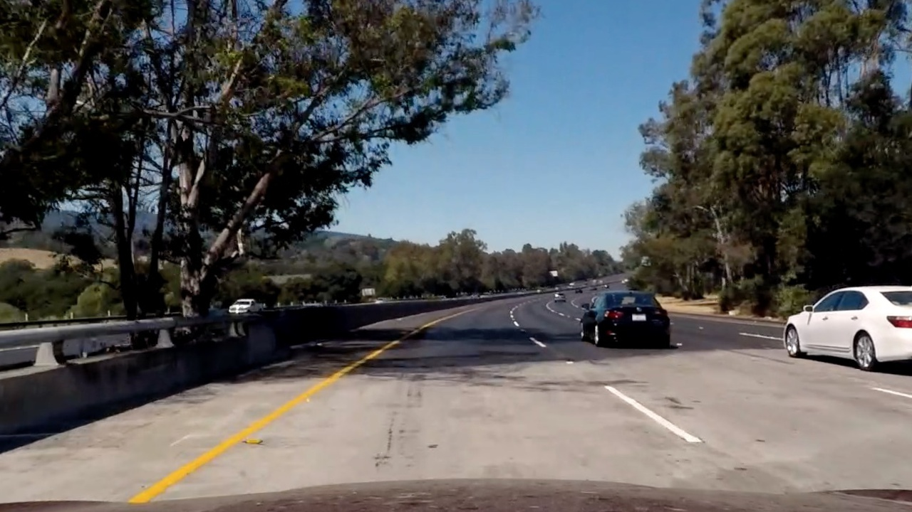
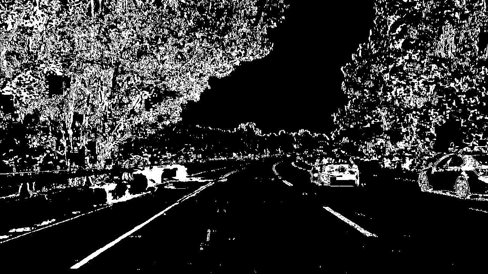
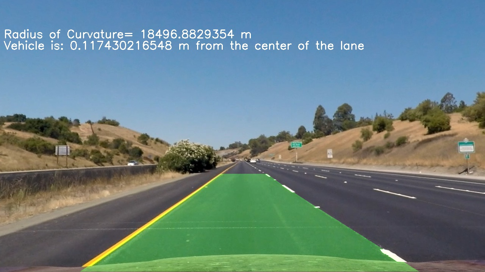

### 1. Briefly state how you computed the camera matrix and distortion coefficients. Provide an example of a distortion corrected calibration image.

The code for this section is in cell one and two of the note book accompanied.

I first read a number of images using a glob object which helped iterating over images. then I converted them into a gray scale image. the next step is to find the corners of each image using findchessboardcorners function. if the corners are found successfully, then the corners of each image is appended to an array called imgpoints.Also "object points", which will be the (x, y, z) coordinates of the chessboard corners in the world. Here I am assuming the chessboard is fixed on the (x, y) plane at z=0, such that the object points are the same for each calibration image. Thus, objp is just a replicated array of coordinates, and objpoints will be appended with a copy of it every time I successfully detect all chessboard corners in a test image. imgpoints will be appended with the (x, y) pixel position of each of the corners in the image plane with each successful chessboard detection.

After then I used imgpoints and objpoints to calibrate the camera. I specifically usedcv2.calibrateCamera function and the output was mtx (camera matrix) and other distortion coefficients. Using the coefficients I undistorted the image bellow: 

<table><tr><td></td><td></td><td></table>

## Pipeline (single images)

### 1. Provide an example of a distortion-corrected image.

To demonstrate this step, I will describe how I apply the distortion correction to one of the test images like this one: 

<table><tr><td></td><td></table>

## 2. Describe how (and identify where in your code) you used color transforms, gradients or other methods to create a thresholded binary image. Provide an example of a binary image result.

I used both gradient and color thresholds for generating binary images. This is done through the function color_pipeline() in the fourth cell code in Advanced-Lane-Lines.ipynb. Here is a binary image after being processed by the above function:

<table><tr><td></td><td></table>

## 3. Describe how (and identify where in your code) you performed a perspective transform and provide an example of a transformed image.

The code for my perspective transform includes a function called warper(), which appears in the 6th code cell of the IPython notebook). The warper() function takes as inputs an image (img), as well as source (src) and destination (dst) points. I chose the hardcode the source and destination points in the following manner:

src = np.float32(
    [[(img_size[0] / 2) - 55, img_size[1] / 2 + 100],
    [((img_size[0] / 6) - 10), img_size[1]],
    [(img_size[0] * 5 / 6) + 60, img_size[1]],
    [(img_size[0] / 2 + 55), img_size[1] / 2 + 100]])
dst = np.float32(
    [[(img_size[0] / 4), 0],
    [(img_size[0] / 4), img_size[1]],
    [(img_size[0] * 3 / 4), img_size[1]],
    [(img_size[0] * 3 / 4), 0]])
This resulted in the following source and destination points:

Source	Destination
585, 460	320, 0
203, 720	320, 720
1127, 720	960, 720
695, 460	960, 0
I verified that my perspective transform was working as expected by drawing the src and dst points onto a test image and its warped counterpart to verify that the lines appear parallel in the warped image.

<table><tr><td></td><td></td><td></table>

## 4. Describe how (and identify where in your code) you identified lane-line pixels and fit their positions with a polynomial?

In the 10th cell of the Advanced-Lane-Lines.ipynb in initiate_lines() funtion, I have first summed up all xs accross all ys and the result is a histogram that has the pick around xs that correspond to the lanes. then I extracted the non zero pixels and put them in an array for both x and y(    nonzero = binary_warped.nonzero() nonzeroy = np.array(nonzero[0]) nonzerox = np.array(nonzero[1])). then I divided the y dimention into 9 windows and iterated from bottom up to locate the maximum concentration of pixels and center them in the windows that I iterated over. the minimum number of the pixels found in each window was set to 50, meaning that if the number of non zero pixels in each small window which had a width of 200 and the hight was 1/9 of the height of the image. all these was done after line 40 of the 10th cell. index of each pixel identified by the sliding windows was appended to to arrays and at the end these arrays contained all the possible left and right pixel indices separately. using these indices I could form arrays of xs and ys separately for each line and then using these lines:     left_fit = np.polyfit(lefty, leftx, 2)
right_fit = np.polyfit(righty, rightx, 2)
I could fit them into the second order polynomial.

 <table><tr><td></td><td></table>

## 5. Describe how (and identify where in your code) you calculated the radius of curvature of the lane and the position of the vehicle with respect to center.

The code for this section is found in cell 16 of Advanced_Lane_Lines.pynb. I first converted pixel values to meter values and then fitted it through polynomial and then used this line:
left_curverad = ((1 + (2*left_fit_cr[0]*y_eval*ym_per_pix + left_fit_cr[1])**2)**1.5) / np.absolute(2*left_fit_cr[0])
where I calculated derivitive x with respect to y to the power of 2 and added 1 to the result then to the power of 1.5 and devided by second derivitive of x with respect to y (dx/dy). the same procedure was done for right_curverad.
as for the position of the vehicle with respect to center, I wrote a function called get_offset_from_center() which is in cell 9 of Advanced_Lane_Lines.pynb. It uses three arguments: the x value of the middle of the image, the x value of the base of the right line and the x value of base of the left line. the resulting value is converted into meters. 

## 6. Provide an example image of your result plotted back down onto the road such that the lane area is identified clearly.

<table><tr><td></td><td></table>

## Pipeline (video)

can be found at : https://github.com/ainode/project4_Advanced_Lane_finding/blob/master/processed.mp4

# Discussion

## 1. Briefly discuss any problems / issues you faced in your implementation of this project. Where will your pipeline likely fail? What could you do to make it more robust?

Main problem with the implementation of this project was to make sure that the program can find the lines and the lane area is identified clearly. the raw implemetation of the codes given through lessons was a good start but it needed addition of a few steps such as implementing a procedure to restart searching from scratch when the program could not find the paths so many times in a row and maintaining the past positions and moving to the next frame if the current frame seems problematic. the pipeline will probably fail if the road has curvatures with narrower angles and unclear/boken lines. If I had the time I would improve the pipeline by looking into frames that cause more problems and look into the parameters such as polynomial coefficients and number of nonzero pixels in the area of search in those frames and try to improve the code and or change parameters such as margin to see how they would affect the performance. 
